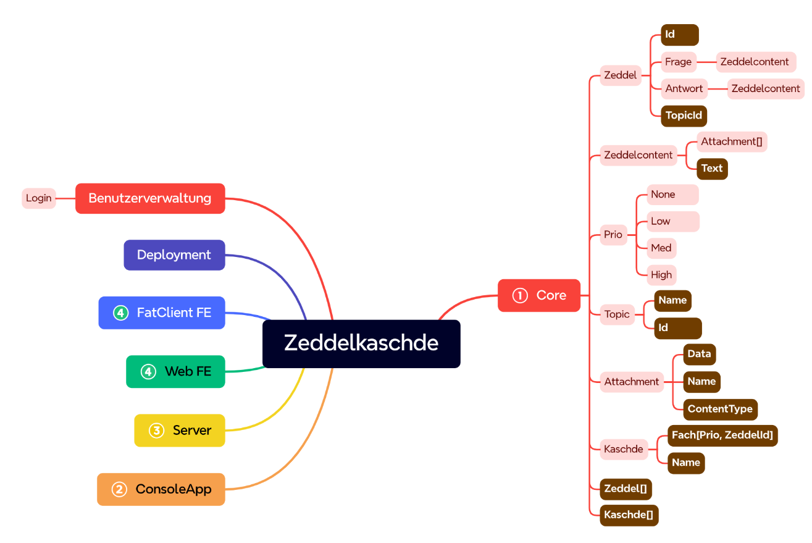

# Zeddelkaschde
## Lernsystem basierend auf dem Leitner-Prinzip
Zeddelkaschde ist ein interaktives Lernsystem, das dir hilft, Wissen nachhaltig zu festigen – ganz nach dem bewährten Leitner-System.
Mithilfe von Lernkarten, auf denen sich vorne eine Frage und hinten die Antwort befindet, kannst du dein Lernen individuell steuern.
Beantwortest du eine Karte korrekt, wandert sie in den nächsten Kasten.
Bei einer falschen Antwort fällt sie zurück in einen früheren Kasten.
So wird sichergestellt, dass du schwierige Themen häufiger wiederholst und dir die Inhalte langfristig besser einprägen kannst.

## Aufbau

